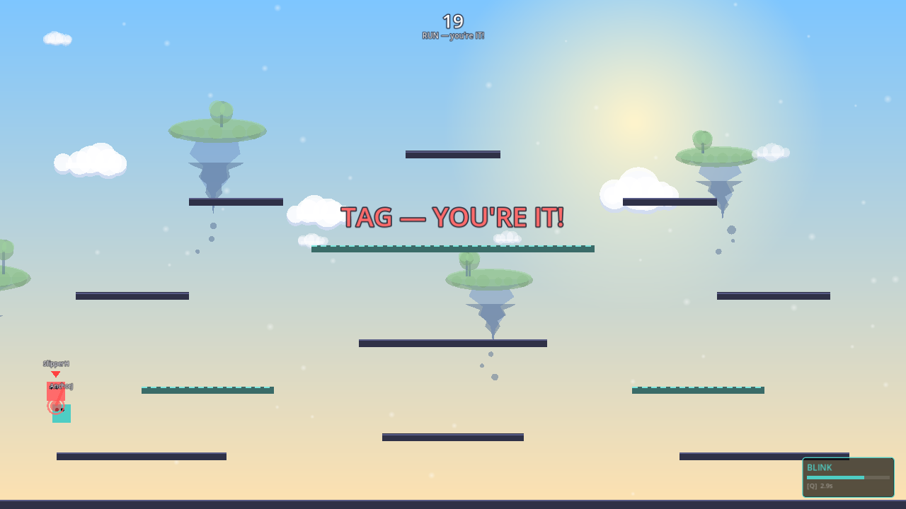
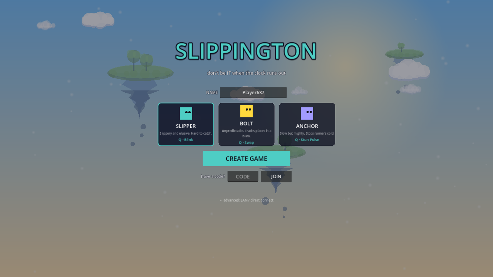

# Slippington

**Don't be IT when the clock runs out.**

A fast, friendly multiplayer game of platformer tag for 2–8 players —
real-time chases across floating islands, classes with swappable tricks up
their sleeves, and exactly one loser per round: whoever's holding the tag
when the buzzer sounds.

## How it plays

One player starts IT (red arrow overhead). Touch someone to pass it on —
the first tag starts a 60-second clock, and when it hits zero, the player
left holding the tag is **CAUGHT**. Everyone else survives. Short rounds,
instant restarts, maximum yelling.

Pick your character:

| Class | Style | Q ability |
|---|---|---|
| **Slipper** | Fast and slippery | **Blink** — teleport ahead, mid-chase |
| **Swapper** | Unpredictable | **Swap** — trade places with the nearest player |
| **Anchor** | Slow, mighty, vindictive | **Stun Pulse** — freeze everyone nearby |

Every map is procedurally generated from a shared seed (plus two
hand-built arenas), with drop-through platforms, drifting clouds, and a
sky that's having a better day than whoever is IT.

## Play it

**[Download for Windows or macOS →](https://github.com/ShawnLi14/slippington/releases/latest)**

Unzip, run, CREATE GAME, and share the 5-letter code — friends enter it
and join from anywhere. No accounts, no setup, no port forwarding.

## Under the hood

Built with **Godot 4.4** around direct **peer-to-peer WebRTC** connections:

- A [tiny signaling server](signaling/) (Fly.io, ~$2/mo) brokers the
  join-code handshake; game traffic then flows directly between players.
- Your own movement is simulated locally (zero input latency); remote
  players replicate at 60 Hz with sender-timeline snapshot interpolation
  and adaptive jitter buffering.
- Tags use **client-side hit detection with host lag-compensated
  validation** (the FPS "favor the shooter" model, capped at 250 ms of
  rewind) — tags land when the chaser sees them land.
- The hosting player's machine referees everything: tags, the clock,
  scoring, ability cooldowns. No game servers to rent or keep alive.
- Headless bot integration tests play full matches over both ENet and
  WebRTC in CI-able fashion, and a [playtest harness](tools/playtest.ps1)
  runs class-matchup batches that emit balance telemetry.

See [`godot/README.md`](godot/README.md) for building, testing, and
export instructions.

## Repo layout

| Folder | What |
|---|---|
| [`godot/`](godot/) | The game (Godot 4.4.1, GDScript) |
| [`signaling/`](signaling/) | Node.js WebRTC signaling server (join codes) |
| [`tools/`](tools/) | Automated playtest batch runner |
| [`legacy/`](legacy/) | The original web prototype (Next.js + Phaser + Supabase), kept for reference — its Postgres-based movement sync is why the rewrite exists |
